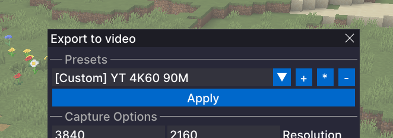
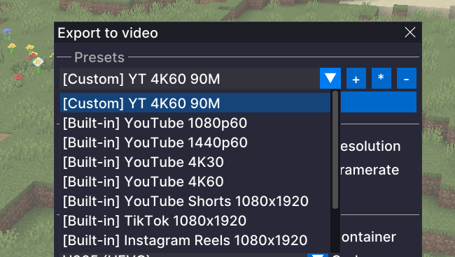

# Flashback Extras

Flashback Extras extends the Flashback replay editor with additional features and fixes.
All features can be toggled on or off.

## Features
- `Export Presets`
  Adds built-in presets for common output targets, such as YouTube 1440p, and lets you create your own presets so you can save the settings you use again and again instead of rebuilding them every time. This is especially useful if you are exporting the same replay in multiple formats.

  
  

- `Export Preview Overlay`
  When you are exporting for formats like TikTok or YouTube Shorts, it is not always clear how the final video will look inside a vertical frame. This adds an overlay that shows that shape on screen, so you can line things up more easily before exporting.

- `Timeline Horizontal Scroll`
  Enables horizontal scrolling of the Flashback timeline with a mouse side wheel, horizontal wheel, or trackpad.

## Fixes
- `Faster First Export`
  Opening the export menu can freeze Flashback for a couple of seconds. This mod prepares export tools in the background shortly after you open a replay, so the export window opens without long waiting times.

- `Audio Track Sync for Timelapses`
  Timelapses and other speed changes in Flashback can make audio sound wrong and break the waveform display. This mod fixes that, so audio plays normally and the visual audio track scales correctly with timeline speed.

## Configure
- You can open the Flashback Extras menu with `Right Alt + P` by default.
- The shortcut can be changed in Minecraft Controls.
- You can also open the menu through the Mod Menu mod.

## Requirements
- Fabric
- Flashback
